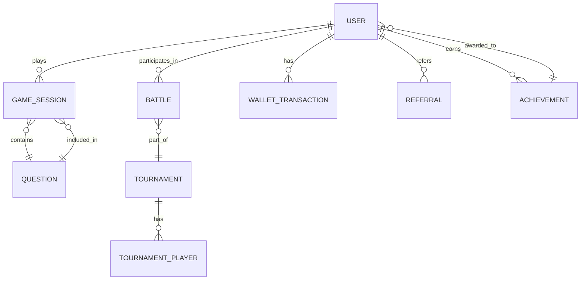
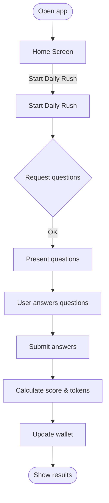
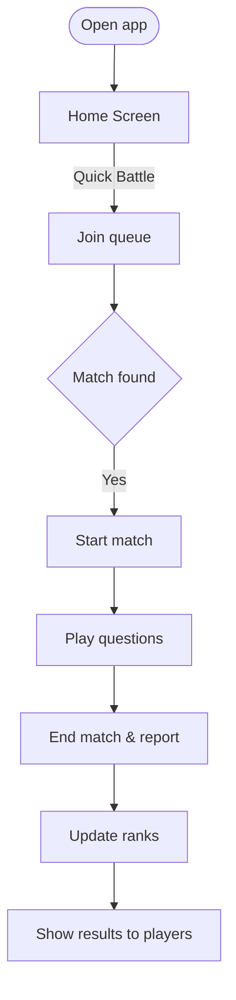

# Architecture Documentation

This document describes the recommended architecture documentation to include with the project submission: an ERD (Entity Relationship Diagram), a DRD (Data Relationship Diagram / data model), and User Journey / Flow diagrams. Provide both a human-readable README (this file) and image/SVG exports of diagrams under `docs/architecture/`.

---

## What to include

- ERD (Entity Relationship Diagram) — a diagram that shows entities and relationships between them (good for relational understanding).
- DRD (Data Relationship Diagram) — a model focused on how data is stored, document shapes (MongoDB collections), and references.
- User Journey / Flow diagrams — step-by-step flows for main user interactions (Daily Rush, Quick Battle, Tournament join, Referral flow).

Place the exported images/SVGs in `docs/architecture/` and reference them from this file.

Recommended filenames:

- `docs/architecture/ERD.mmd` and `docs/architecture/ERD.png`
- `docs/architecture/DRD.json` and `docs/architecture/DRD.png`
- `docs/architecture/user-journey-*.mmd` and `docs/architecture/user-journey-*.png`

---

## ERD (Entity Relationship Diagram)

Purpose: show high-level domain entities and cardinality between them.

Example (Mermaid `erDiagram`) — export as PNG/SVG for submission:



Explanation:

- `USER` — primary account holder; stores profile and preferences.
- `QUESTION` — question bank items used across game modes.
- `GAME_SESSION` — ephemeral session for Daily Rush or single-player games.
- `BATTLE` — 1v1 or multiplayer match instance.
- `TOURNAMENT` / `TOURNAMENT_PLAYER` — scheduled tournaments and participants.
- `WALLET_TRANSACTION` — token credit/debit history.
- `ACHIEVEMENT` — unlocked milestones linked to users.

Notes on cardinality:

- One `USER` can have many `GAME_SESSION`, `BATTLE`, `WALLET_TRANSACTION`, `ACHIEVEMENT`, and `REFERRAL` records.
- `GAME_SESSION` contains multiple `QUESTION` references; these can be embedded or referenced depending on access patterns.

---

## DRD (Data Relationship Diagram / Document Shapes)

Purpose: show how documents are stored in MongoDB, what fields are indexed, and where references vs embedding are used.

Example collection shapes (JSON examples):

### `users` document (simplified)

```json
{
  "_id": "ObjectId",
  "email": "user@example.com",
  "displayName": "Jane Doe",
  "profile": { "avatarUrl": "..." },
  "wallet": { "balance": 123 },
  "achievements": ["achievementId1", "achievementId2"],
  "createdAt": "ISODate"
}
```

### `questions` document

```json
{
  "_id": "ObjectId",
  "text": "What is 2+2?",
  "choices": ["1","2","3","4"],
  "answerIndex": 3,
  "tags": ["math","easy"],
  "meta": { "difficulty": "easy" }
}
```

### `game_sessions` document

```json
{
  "_id": "ObjectId",
  "userId": "ObjectId",
  "questions": [{ "questionId": "ObjectId", "answerIndex": 3 }],
  "score": 8,
  "startedAt": "ISODate",
  "finishedAt": "ISODate"
}
```

### `battles` document

```json
{
  "_id": "ObjectId",
  "players": [ { "userId": "ObjectId", "score": 10 } ],
  "state": "finished",
  "startedAt": "ISODate",
  "endedAt": "ISODate",
  "tournamentId": "ObjectId?"
}
```

### `wallet_transactions` document

```json
{
  "_id": "ObjectId",
  "userId": "ObjectId",
  "amount": 50,
  "type": "credit|debit",
  "reason": "daily-rush|referral|purchase",
  "createdAt": "ISODate"
}
```

Indexing recommendations:

- Index `users.email` (unique) and `users._id` (default).
- Index `questions.tags`, `questions.meta.difficulty` for targeted queries.
- Index `game_sessions.userId` and `battles.players.userId` for quick lookups.

Embedding vs referencing guidance:

- Embed small, read-mostly sub-documents used together (e.g., question snapshot in a finished `game_session`).
- Reference large or shared collections (e.g., `questions`) to avoid duplication.

---

## User Journey / Flow diagrams

Purpose: visual flows that show typical user interactions and system responsibilities.

Example flow for Daily Rush (Mermaid flowchart):



Example flow for Quick Battle:



Tips for user-journey diagrams:

- Keep each diagram to a single primary flow.
- Annotate system responsibilities (API, Worker, DB) on the steps where appropriate.
- Export in both PNG and SVG for clarity.

---

## Submission checklist

- This `ARCHITECTURE.md` (human-readable overview)
- `docs/architecture/ERD.png` and/or `ERD.svg`
- `docs/architecture/DRD.png` and/or `DRD.svg` (or `DRD.json` document shapes)
- `docs/architecture/user-journey-*.png` (one per flow)
- Optional: `.mmd` (Mermaid) or source files from diagrams.net, Figma, or similar

---

## Tools & resources

- diagrams.net (draw.io) — quick visual diagrams and PNG/SVG export
- Mermaid — lightweight text-based diagrams (useful for repo source)
- Lucidchart, Figma, or similar for high-fidelity diagrams

---

If you'd like, I can generate example PNGs from the mermaid snippets and add them under `docs/architecture/`.

---

Last updated: 2026-01-11
