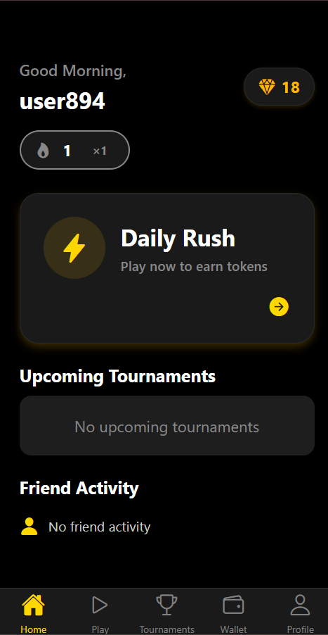
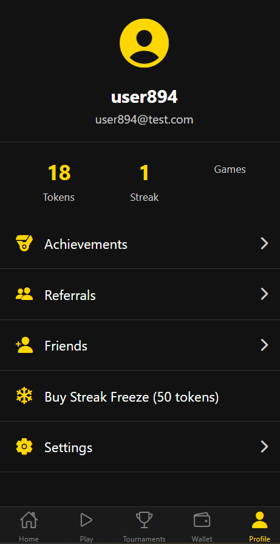

# SmartRewards - Quiz Game App

A full-stack React Native quiz game with real-time battles, tournaments, and token rewards.


## Media

### Application Previews
| Home Screen | Profile Screen |
| :---: | :---: |
|  |  |

### Demo Video
<video src="app/assets/videos/SmartRewards.mp4" controls="controls" style="max-width: 600px;">
  Your browser does not support the video tag.
</video>


## Features

- Daily Rush: Answer questions fast to earn tokens
- Quick Battle: 1v1 async battles
- Tournaments: Compete in scheduled tournaments
- Leaderboards: Daily, weekly, monthly rankings
 Start server in `server/` and Expo in `app/`.

 Server quick commands:

 ```bash
 cd server
 npm install
 npm run seed-questions   # populate question bank
 npm run dev              # start server with nodemon
 ```

 Run tests:

 ```bash
 cd server
 npm install
 npm test
 ```

API endpoints (brief):

- `POST /api/game/daily-rush/start` { userId } -> returns questions or 400 if missing userId
- `POST /api/game/daily-rush/finish` { userId, answers } -> submits answers, returns score/tokens; answers must be an array

See `server/routes` for full route list.
- Wallet: Track tokens and transactions
- Referrals: Earn tokens by inviting friends

## Tech Stack

- **Frontend**: React Native with Expo
- **Backend**: Node.js, Express, Socket.io
- **Database**: MongoDB with Mongoose
- **Authentication**: Email-based (no passwords for simplicity)

## Interview Submission

If you're preparing this project for an interview or evaluation, include the following in your repository:

- **Complete source code** of the application (frontend and backend)
- **A demo video** demonstrating core features and functionality
- **Architecture documentation**, including all three:
   - ERD (Entity Relationship Diagram)
   - DRD (Data Relationship Diagram)
   - User Journey / Flow diagrams

## Setup

### Prerequisites

- Node.js 18+
- MongoDB
- Expo CLI

### Backend Setup

1. cd server
2. npm install
3. cp .env.example .env (update values)
4. npm run seed (populate database)
5. npm start

### Frontend Setup

1. cd app
2. npm install
3. cp .env.example .env (update API_BASE_URL)
4. npx expo start

## Environment Variables

### Backend (.env)

```
NODE_ENV=production
MONGODB_URI=mongodb://localhost:27017/smartrewards
JWT_SECRET=your-secret-key
PORT=5000
```

### Frontend (.env)

```
API_BASE_URL=https://your-api-domain.com
```

## Production Deployment

### Backend

1. Use PM2 for process management:
   ```
   npm install -g pm2
   pm2 start server.js --name smartrewards
   ```

2. Use MongoDB Atlas for database

3. Set environment variables in production

4. Use nginx as reverse proxy

### Frontend

1. Build for production:
   ```
   npx expo build:android
   npx expo build:ios
   ```

2. Submit to app stores

## Security

- Rate limiting implemented
- Input validation with validator library
- Helmet for security headers
- CORS configured

## API Documentation

Base URL: `/api`

### Auth
- POST /auth/login - User login/registration

### Game
- POST /game/daily-rush/start - Start daily rush
- POST /game/daily-rush/finish - Finish daily rush

### Battle
- POST /battle/join - Join quick battle
- GET /battle/:id/status - Get battle status

### Tournaments
- GET /tournament/upcoming - Get upcoming tournaments
- POST /tournament/join - Join tournament

### Leaderboard
- GET /leaderboard/daily - Daily leaderboard

## License

MIT